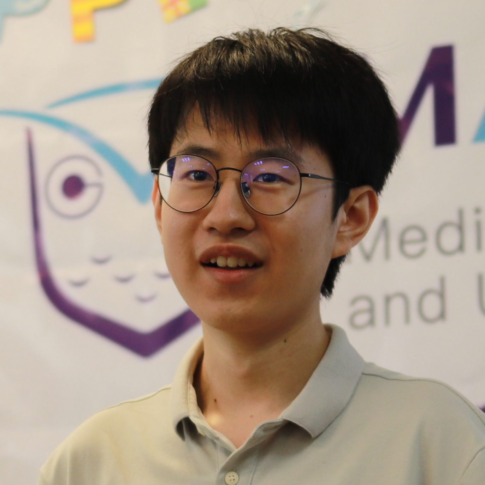

## About Me

Hi! I am currently a research assistant at [THUNLP](http://nlp.csai.tsinghua.edu.cn/) and supervised by Prof. [Zhiyuan Liu](http://nlp.csai.tsinghua.edu.cn/~lzy/). I just obtain my bachelor degree from Nanjing University in June 2020. During my undergraduate period, I worked at [MAGUS](https://magus.ink/) Lab and was supervised by Prof. [Tongwei Ren](https://software.nju.edu.cn//rentw/index.html). 

## Research Interest

My research interests mainly lie on multi-modal understanding especially relation detection under visual context and cross-modal retrieval.

## Publications

1. Tongwei Ren, **Ao Zhang**. RGB-D Salient Object Detection: A Review. Book Chapter of RGB-D Image
   Analysis and Processing 2019(Part of the [Advances in Computer Vision and Pattern Recognition](https://link.springer.com/bookseries/4205) book series (ACVPR))[[pdf](https://link.springer.com/chapter/10.1007/978-3-030-28603-3_9)\]
2. Wenhui Li, Anan Liu, Weizhi Nie, Dan Song, Yuqian Li, Weijie Wang, Shu  Xiang, Heyu Zhou, Ngoc-Minh Bui, Yunchi Cen, Zenian Chen, Huy-Hoang  Chung-Nguyen, Gia-Han Diep, Trong-Le Do, Eugeni L. Doubrovski, Anh-Duc  Duong, Jo M. P. Geraedts, Haobin Guo, Trung-Hieu Hoang, Yichen Li, Xing  Liu, Zishun Liu, Duc-Tuan Luu, Yunsheng Ma, Vinh-Tiep Nguyen, Jie Nie,  Tongwei Ren, Mai-Khiem Tran, Son-Thanh Tran-Nguyen, Minh-Triet Tran,  The-Anh Vu-Le, Charlie C. L. Wang, Shijie Wang, Gangshan Wu, Caifei  Yang, Meng Yuan, Hao Zhai, **Ao Zhang**, Fan Zhang, Sicheng Zhao. Monocular  image based 3D model retrieval. Eurographics Workshop on 3D Object  Retrieval (EGW'19-3DOR), Genoa, Italy, 2019. (**Tie for 2nd place in SHREC 2019 contest**) \[[pdf](https://magus.ink/homepage_static/paper/shrec19-liw.pdf)\]\[[code](https://github.com/waxnkw/gvcnn-pytorch)\]

## Experience/Education

Year | Experience/Education |  
-----|:------|--------
*2020/9-Now* | **Research assistant at THUNLP,  Tsinghua University** |  
*2018/10-2020/7* | **Researcher at MAGUS,  Nanjing University** |      
*2016/9-2020/7* | **B.S. in Software Engineering, Nanjing University** |  

